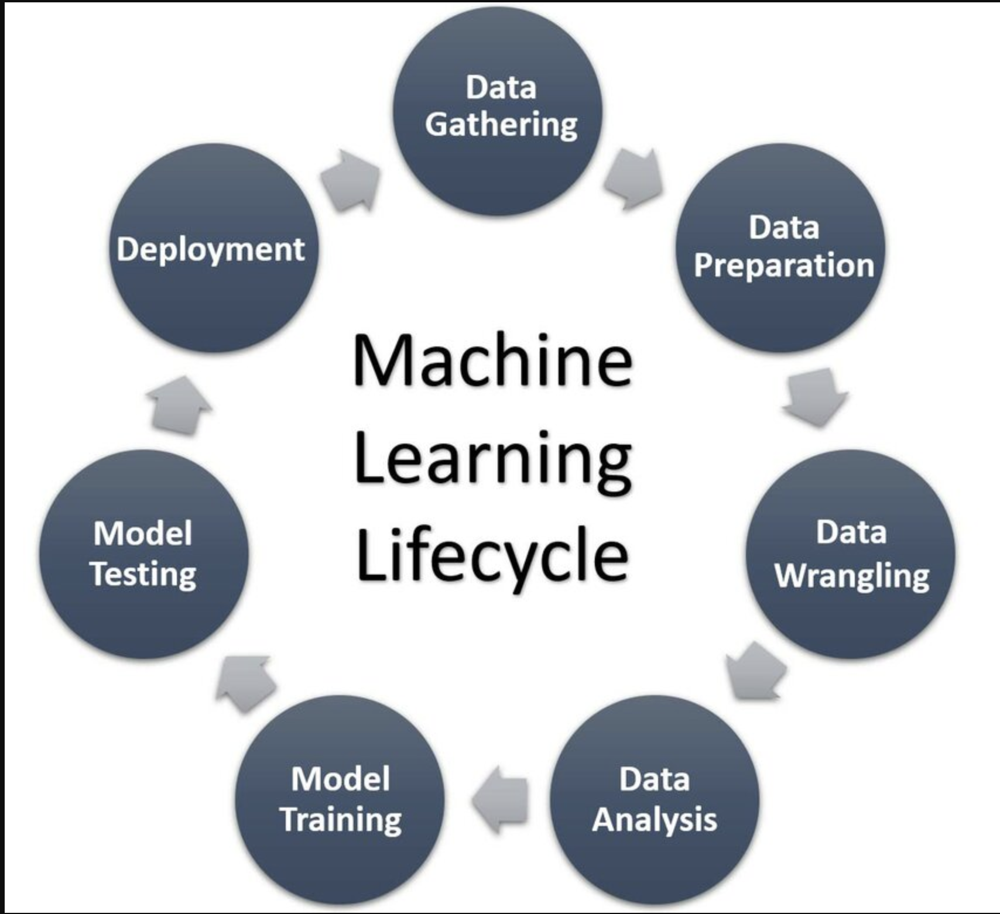

# Fake News Detection + MLOPS Life cycle
This comprehensive guide will help you understand, customize, and efficiently utilize the template to align with your project requirements.

## 🧠 Machine Learning Lifecycle

  

## 📌 Project Overview
This project aims to detect fake news using machine learning techniques. It uses natural language processing (NLP) to analyze the text of news articles and classify them as **real or fake**.

## 🧪 Tech Stack
- **Programming Language:** Python
- **Libraries/Frameworks:** scikit-learn, pandas, NumPy, NLTK, MLOps, Flask
- **IDE/Tools:** Jupyter Notebook / VS Code

## 🔍 Project Structure

├── api
│   ├── api.py           # API for model serving
│   ├── model.pkl        # Serialized model file
│   └── vectorizer.pkl   # Serialized feature vectorizer
├── artifacts
│   ├── raw_data.zip     # Compressed dataset
├── config
│   └── settings.ini     # Configuration settings
├── notebooks
│   └── data_exploration.ipynb # Jupyter notebook for data analysis
├── src
│   ├── pipeline
│   │   ├── stage_01_ingestion.py    # Data ingestion script
│   │   ├── stage_02_preprocessing.py # Data preprocessing script
│   │   ├── stage_03_training.py      # Model training script
│   │   └── stage_04_evaluation.py    # Model evaluation script
│   └── utils
│       ├── config.py    # Configuration parser
│       └── logger.py    # Custom logger
├── .gitignore            # Specifies intentionally untracked files to ignore
├── README.md             # README file
├── Dockerfile            # Dockerfile for containerization
├── main.py               # Main script to run pipeline steps
├── requirements.txt      # Project dependencies
└── template.py           # Template script
